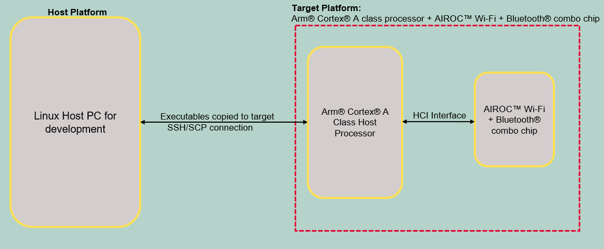

# AIROC™ BTSTACK: Bluetooth® A2DP source for Linux host

The code example demonstrates an A2DP source using AIROC™ Wi-Fi & Bluetooth&reg; combo chip on Linux platform.

The application acts as an audio streaming source device and can be connected to A2DP Sink devices such as headset, earphones, or speaker. When a remote A2DP sink and local A2DP device is set in pairable mode and devices are successfully bonded, the application saves the peer's Bluetooth® device address to its bonded device list.
Once the connection is made, the audio stream starts on the A2DP source and the application streams the audio from the local audio file selected for the remote A2DP sink (headset or speaker) that is already connected.
The application supports Bluetooth® Standard SBC encoder and sampling frequencies of 44.1 kHz and 48 kHz. The application supports reading and encoding of 44.1 kHz and 48 kHz *.wav* format files.
The CE supports a maximum of 1 paired device.

[View this README on GitHub.](https://github.com/Infineon/linux-example-btstack-a2dp-source)

[Provide feedback on this code example.](https://cypress.co1.qualtrics.com/jfe/form/SV_1NTns53sK2yiljn?Q_EED=eyJVbmlxdWUgRG9jIElkIjoiQ0UyMzY4OTYiLCJTcGVjIE51bWJlciI6IjAwMi0zNjg5NiIsIkRvYyBUaXRsZSI6IkFJUk9D4oSiIEJUU1RBQ0s6IEJsdWV0b290aMKuIEEyRFAgc291cmNlIGZvciBMaW51eCBob3N0IiwicmlkIjoiamlhbmcgZGEgeW91IiwiRG9jIHZlcnNpb24iOiIxLjAuMCIsIkRvYyBMYW5ndWFnZSI6IkVuZ2xpc2giLCJEb2MgRGl2aXNpb24iOiJNQ0QiLCJEb2MgQlUiOiJJQ1ciLCJEb2MgRmFtaWx5IjoiQUlST0MifQ==)

## Requirements

- Programming language: C
- Embedded Linux platforms (Arm&reg; Cortex&reg;-A Class processors) for host communications. Supported Embedded Linux host platforms:
   1. RPI CM4-lite IFX custom HW board from Infineon
   2. [IMX8 nano uCOM board](https://www.embeddedartists.com/products/imx8m-nano-developers-kit-v3/) from Embedded Artists
- AIROC™ BTSTACK library and Linux porting layer source code
- AIROC™ Wi-Fi & Bluetooth® combo chip Bluetooth® Firmware file (*.hcd*).
- Linux Host PC with Ubuntu 20.04


## Supported toolchains (make variable 'TOOLCHAIN')

- GNU Arm® GCC AArch64 v9.3.0 (`GCC_ARM`)

## Supported AIROC™ Wi-Fi & Bluetooth® Combo Chip

- [AIROC™ CYW5557x Wi-Fi & Bluetooth® Combo Chip](https://www.infineon.com/cms/en/product/wireless-connectivity/airoc-wi-fi-plus-bluetooth-combos/wi-fi-6-6e-802.11ax/)

## Hardware setup

Set up the hardware according to the following diagram:

**Figure 1. Block diagram: Hardware setup**



## Software setup

Set up a cross compiler according to the target platform along with CMake on the Linux host PC based on Ubuntu 20.04.

1. Open a terminal on the Ubuntu host PC.

2. Use the following command to install the cross compiler, build tools, and dependencies:
   ```bash
   sudo apt-get install git cmake gcc-aarch64-linux-gnu build-essential -y
   ```

## Using the code example

Do the following on the Host Linux PC to compile the code example:

1. Create a directory under `$HOME` on the Linux host PC and switch to the created directory. Use the following commands, for example:
   ```bash
   mkdir $HOME/Linux_CE
   cd $HOME/Linux_CE
   ```
   **Note:** Replace *Linux_CE* with a directory of your choice.

2. Fetch the code example source code using the following command:
   ```bash
   git clone https://github.com/Infineon/linux-example-btstack-a2dp-source
   ```

3. Clone or prepare the code example dependencies (BTSTACK library, Linux porting layer, audio profiles source code, and Linux audio library) using the following commands and hints:
   ```bash
   git clone https://github.com/Infineon/btstack --branch release-v3.6.0
   git clone https://github.com/Infineon/bluetooth-linux.git --branch release-v2.0.0
   git clone https://github.com/Infineon/bt-audio-profiles.git --branch release-v1.0.0
   ```

   Four different directories are created after cloning the code example and its dependencies; see the following image:

   **Figure 2. Code example directory structure**

   

4. Clone the Bluetooth® firmware using following command:
   ```bash
   git clone https://github.com/Infineon/combo-bluetooth-firmware.git
   ```
   User can choose appropriate Bluetooth® firmware for particular AIROC™ Wi-Fi & Bluetooth® combo chip from cloned "combo-bluetooth-firmware" directory.

5. Create the build folder under the code example source folder and build the code example using the following commands:
   ```bash
   cd $HOME/Linux_CE/linux-example-btstack-a2dp-source
   mkdir build && cd build
   cmake -DCMAKE_C_COMPILER:PATH=<GCC_CROSS_COMPILER> ../ && make
   ```
   Where,
   - `GCC_CROSS_COMPILER` is the target cross compiler for GCC (generally */usr/bin/aarch64-linux-gnu-gcc* for ARM64-based targets)

   The code example executable is generated under the *build* folder with the same name.

   For example, in this project, the "linux-example-btstack-a2dp-source" executable is generated at */home/$USER/Linux_CE/linux-example-btstack-a2dp-source/build*.

## Features demonstrated
- A2DP connection to sink
- A2DP audio stream configuration
- Start Streaming
- Stop Streaming
- A2DP Disconnection

## Operation

The code example acts as an A2DP source. The remote device will be the A2DP sink like Bluetooth® speaker, Bluetooth® headset, and so on.

### Devices used

- **Device Under Test (DUT):** Embedded Linux host platforms with AIROC™ Wi-Fi & Bluetooth® Combo Chip (target platform) that runs the A2DP source code example.

   Role: "A2DP Source"

- **Testing device:** Bluetooth® speaker or headset

  Role: "A2DP Sink"

1. Copy the code example executable, AIROC™ BTSTACK library, audio profiles source code, Linux audio library, and Bluetooth® Firmware file from the Linux host PC to the target platform using [SCP](https://help.ubuntu.com/community/SSH/TransferFiles). For example, use the following commands.
   ```bash
   cd $HOME/Linux_CE/linux-example-btstack-a2dp-source/build
   scp linux-example-btstack-a2dp-source <TARGET_USER>@<TARGET_IP>:<TARGET_PATH>/.
   cd $HOME/Linux_CE/btstack/stack/COMPONENT_WICED_DUALMODE/COMPONENT_ARMv8_LINUX/COMPONENT_GCC
   scp libbtstack.so <TARGET_USER>@<TARGET_IP>:<TARGET_PATH>/.
   cd $HOME/Linux_CE/bt-audio-profiles/sbc/COMPONENT_ARMv8_LINUX/COMPONENT_GCC
   scp libsbc.so <TARGET_USER>@<TARGET_IP>:<TARGET_PATH>/.
   cd $HOME/Linux_CE/combo-bluetooth-firmware/<COMBO_CHIP>/<PACKAGE>/.
   scp <FW_FILE.hcd> <TARGET_USER>@<TARGET_IP>:<TARGET_PATH>/.
   ```
   Where,
   - `TARGET_USER` is the user name of the target platform.
   - `TARGET_IP` is the IP address of the target platform.
   - `TARGET_PATH` is the path of the target platform.
   - `COMBO_CHIP` is AIROC™ Wi-Fi & Bluetooth® combo chip name
   - `PACKAGE` is AIROC™ Wi-Fi & Bluetooth® combo chip package
   - *`FW_FILE.hcd`* file is Bluetooth® Firmware file cloned in step-4 of [Using the code example section](#using-the-code-example).

2. Copy the required sample audio files that are streamed to the remote sink:
   ```bash
   cd $HOME/Linux_CE/linux-example-btstack-a2dp-source/audio_test_files
   scp 44K.wav <TARGET_USER>@<TARGET_IP>:<TARGET_PATH>/.
   scp 48K.wav <TARGET_USER>@<TARGET_IP>:<TARGET_PATH>/.
   ```
   "44K.wav" is for 44.1-kHz sampling frequency and "48K.wav" is for 48-kHz sampling frequency.

3. Take SSH console of target platform.
   ```bash
   ssh <TARGET_DEVICE_USER_NAME>@<TARGET_DEVICE_IP_ADDRESS>
   ```

4. Add the udev rule in the target board for HCI UART and GPIO to bypass root access. Use the following steps to create and set up a udev rule.

   **Note:** If you have root access, the following udev rules are not required; you can execute the code example with `sudo` permissions or by switching to the root user.

   1. Create a new *.rules* (for example, *combo-chip-uart-port.rules*) file under */etc/udev/rules.d/* directory for HCI UART. Use the following commands:

      **IMX8Nano:**

      ```bash
      echo "KERNEL==\"ttymxc0\"d,SYMLINK+=\"combo_chip_uart\",MODE=\"0666\"" | sudo tee /etc/udev/rules.d/combo-chip-uart-port.rules
      ```

      **RPICM4:**

      ```bash
      echo "KERNEL==\"ttyAMA0\",SYMLINK+=\"combo_chip_uart\",MODE=\"0666\"" | sudo tee /etc/udev/rules.d/combo-chip-uart-port.rules
      ```

   2. Create new *.rules* (for example, *combo-chip-gpio-port.rules*) for BT_REG_ON GPIO under */etc/udev/rules.d/*. Use the following commands:

      **IMX8Nano and RPICM4:**

      1. Create a rule file using the following command.

         ```bash
         sudo vim /etc/udev/rules.d/combo-chip-gpio-port.rules.rules
         ```

      2. Add the following rules in created files:

         ```bash
         SUBSYSTEM=="gpio*", PROGRAM="/bin/sh -c 'chown -R $user:$group /sys/class/gpio/export /sys/class/gpio/unexport;'"
         SUBSYSTEM=="gpio*", PROGRAM="/bin/sh -c 'chown -R $user:$group /sys%p/direction /sys%p/value; chmod 660 /sys%p/direction /sys%p/value;'"
         ```

   3. Reboot the target device:

         ```bash
         sudo reboot
         ```

      Where,

      - `ttymxc0` and `ttyAMA0` are HCI UART ports for IMX8Nano and RPICM4 respectively
      - `combo_chip_uart` is a friendly name for the HCI UART port
      - `0666` is the permission mask to bypass the root access for HCI UART

5. Execute the application with setting the paths of the AIROC™ BTSTACK library using the following command on the target platform:

   ```bash
   cd <TARGET_PATH>
   chmod +x <APP_NAME>
   LD_LIBRARY_PATH=$LD_LIBRARY_PATH:<BTSTACK_LIB_PATH>
   ./<APP_NAME> -c <COM_PORT> -b 3000000 -f 921600 -r <GPIOCHIPx> <REGONPIN> -n -p <FW_FILE_NAME>.hcd -d 112233221137
   ```
   Where,
   - `APP_NAME` is the code example application executable
   - `TARGET_PATH` is the path of the target platform where the code example application copied to
   - `BTSTACK_LIB_PATH` is the path of the AIROC™ BTSTACK library. Skip this if the AIROC™ BTSTACK library and code example application executable are in the same folder
   - `/dev/ttymxc0` is the COM_PORT for IMX8Nano
   - `/dev/ttyAMA0` is the COM_PORT for RPICM4
   - `3000000` is the HCI baud rate
   - `112233221137` is a device BD address
   - `-r <GPIOCHIPx> <REGONPIN> -n`  is setting the GPIO control to enable autobaud for AIROC™ Wi-Fi & Bluetooth® combo chip
      - `-r gpiochip5 0 -n`  For IMX8Nano
      - `-r gpiochip0 3 -n`  For RPICM4
   - `921600` is the firmware download baud rate
   - *`.hcd`* is the firmware file to download (make sure to validate this firmware file file path)

      **Note-1:** Currently, random BD addresses are used for testing.  
      **Note-2:** The CE supports a maximum of one paired device. If the user is connecting to a new device, then the *nvramxxx.bin* should be deleted on the DUT.

6. The following menu is presented on the console for the user to choose from:

   ```bash
         =================================
               A2DP source menu
         ---------------------------------
            0.  Exit
            1.  Read Local BD address
            2.  Set Pairing Mode
            3.  Inquiry
            4.  Connect A2DP Sink
            5.  Disconnect A2DP Sink
            6.  Stream Configure
            7.  Stream Start
            8.  Stream Stop
         =================================
         Choose option (0-8):
   ```
7. Use the following sequence to validate A2DP Source functionality:
   1. Set pairing mode, select option #2 and then #1 to allow pairing.
   2. Discover the Bluetooth® devices that are in the range. Select option #3 and then #1 to start inquiry. Bluetooth® address, Class of Device and RSSI values of remote devices are displayed as a result of inquiry.
   3. Note down Bluetooth® address of A2DP Sink device and cancel the ongoing inquiry. Select Option #3 and then #0.
   4. Connect to A2DP Sink device. Select option #4 and enter Bluetooth® address of A2DP sink device in XX XX XX XX XX XX format.
   5. Configure the stream for required sampling frequency: (1- 48 kHz, 2- 44.1kHz). Select option #6 and then select require sampling frequency using option #1 or #2.
   6. Once configured, the user can start streaming. This option streams to the already connected device. The audio file name for 44.1-kHz frequency is embedded in the code as "44K.wav" and for 48-kHz frequency, it is "48K.wav". Select option #7 to start stream.
8. User can choose to terminate stream and connection. This can be done after using the streaming feature.
   1. Terminate currently streaming A2DP music. Select option #8.
   2. Disconnect the already connected Sink. Select option #5.
   3. Close A2DP source application. select option #0.

   Audio files should be present in the current directory of the application binary. (For reference, check 'audio_test_files' folder in this source directory).
   Developer can change the files in the source or rename new files to these names in order to test.  
   **CAUTION:** This code example loads the entire file into a buffer; therefore, if developers are using a larger file, it may result in memory faults. They can choose to modify the logic to read partial file contents as required.

## Debugging

You can debug the example using a generic Linux debugging mechanism such as the following:

- **Debugging by logging:** You can add prints in the application and check it during the execution.

- **Debugging using GDB:** See [GDB man page](https://linux.die.net/man/1/gdb) for more details.

## Design and implementation

This code example does the following:

1. Parses the command-line arguments

2. Initializes the AIROC™ BTSTACK library for the AIROC™ Wi-Fi & Bluetooth® Combo Chip

3. Registers the A2DP source service with the Stack.

**Figure 3. A2DP source process flowchart**


4. Waits until there is connection with an A2DP source device.

5. Initializes the Platform audio driver and the SBC decoder.

6. Waits for the audio stream start.

7. On receiving the audio data from source, the application calls the SBC decoder to decode audio packets and streams the PCM data to the audio driver.

8. It continues step 7 until it receives the Pause, Disconnect, or Exit application.

**Note:** Run the application without any arguments to get details of the command-line arguments.

## Source files

 Files   | Description of files
 ------- | ---------------------
 *app/main.c*  | Implements the main function which takes the user command-line inputs. Calls the *a2dp_source.c* functions for all the A2DP Source profile functionalities. 
 *app/a2dp_source.c*  | Implements all functionalities related to A2DP Source.
 *app_bt_config/wiced_bt_cfg.c*  | This file is pre-generated using “Bluetooth&reg; configurator” on Windows. This file contains configurations related to BT settings, GAP and A2DP source. 
 *app_bt_utils/app_bt_utils.c*  | Contains all the utility functions. For example, it contains functions to print error codes, status, etc. in a user-understandable format.
 *app_bt_utils/app_bt_utils.h*  | Header file corresponding to *app_bt_utils.c*
 *include/a2dp_source.h*  | Header file corresponding to *a2dp_source.c*.

### Resources and settings

**Table 1. Application resources**

 Resource  |  Alias/object     |    Purpose
 :-------- | :-------------    | :------------
 UART |HCI| UART is used for HCI communication with host system

<br>

## Related resources

Resources  | Links
-----------|----------------------------------
Device documentation | [CYW5557x](https://www.infineon.com/cms/en/product/wireless-connectivity/airoc-wi-fi-plus-bluetooth-combos/cyw5557x/)
AIROC™ BTSTACK library | [AIROC™ BTSTACK library](https://github.com/Infineon/btstack/tree/release-v3.6.0)
Linux porting layer source code | [Linux porting layer source code](https://github.com/Infineon/bluetooth-linux/tree/release-v1.0.0)

## Other resources

Infineon provides a wealth of data at [www.infineon.com](https://www.infineon.com/) to help you select the right device, and quickly and effectively integrate it into your design.

## Document history

Document title: *CE236896* – *AIROC™ BTSTACK: Bluetooth® A2DP source for Linux host*

 Version | Description of change
 ------- | ---------------------
 1.0.0   | New code example

<br>

---------------------------------------------------------

© Cypress Semiconductor Corporation, 2023. This document is the property of Cypress Semiconductor Corporation, an Infineon Technologies company, and its affiliates ("Cypress").  This document, including any software or firmware included or referenced in this document ("Software"), is owned by Cypress under the intellectual property laws and treaties of the United States and other countries worldwide.  Cypress reserves all rights under such laws and treaties and does not, except as specifically stated in this paragraph, grant any license under its patents, copyrights, trademarks, or other intellectual property rights.  If the Software is not accompanied by a license agreement and you do not otherwise have a written agreement with Cypress governing the use of the Software, then Cypress hereby grants you a personal, non-exclusive, nontransferable license (without the right to sublicense) (1) under its copyright rights in the Software (a) for Software provided in source code form, to modify and reproduce the Software solely for use with Cypress hardware products, only internally within your organization, and (b) to distribute the Software in binary code form externally to end users (either directly or indirectly through resellers and distributors), solely for use on Cypress hardware product units, and (2) under those claims of Cypress’s patents that are infringed by the Software (as provided by Cypress, unmodified) to make, use, distribute, and import the Software solely for use with Cypress hardware products.  Any other use, reproduction, modification, translation, or compilation of the Software is prohibited.
<br>
TO THE EXTENT PERMITTED BY APPLICABLE LAW, CYPRESS MAKES NO WARRANTY OF ANY KIND, EXPRESS OR IMPLIED, WITH REGARD TO THIS DOCUMENT OR ANY SOFTWARE OR ACCOMPANYING HARDWARE, INCLUDING, BUT NOT LIMITED TO, THE IMPLIED WARRANTIES OF MERCHANTABILITY AND FITNESS FOR A PARTICULAR PURPOSE.  No computing device can be absolutely secure.  Therefore, despite security measures implemented in Cypress hardware or software products, Cypress shall have no liability arising out of any security breach, such as unauthorized access to or use of a Cypress product. CYPRESS DOES NOT REPRESENT, WARRANT, OR GUARANTEE THAT CYPRESS PRODUCTS, OR SYSTEMS CREATED USING CYPRESS PRODUCTS, WILL BE FREE FROM CORRUPTION, ATTACK, VIRUSES, INTERFERENCE, HACKING, DATA LOSS OR THEFT, OR OTHER SECURITY INTRUSION (collectively, "Security Breach").  Cypress disclaims any liability relating to any Security Breach, and you shall and hereby do release Cypress from any claim, damage, or other liability arising from any Security Breach.  In addition, the products described in these materials may contain design defects or errors known as errata which may cause the product to deviate from published specifications. To the extent permitted by applicable law, Cypress reserves the right to make changes to this document without further notice. Cypress does not assume any liability arising out of the application or use of any product or circuit described in this document. Any information provided in this document, including any sample design information or programming code, is provided only for reference purposes.  It is the responsibility of the user of this document to properly design, program, and test the functionality and safety of any application made of this information and any resulting product.  "High-Risk Device" means any device or system whose failure could cause personal injury, death, or property damage.  Examples of High-Risk Devices are weapons, nuclear installations, surgical implants, and other medical devices.  "Critical Component" means any component of a High-Risk Device whose failure to perform can be reasonably expected to cause, directly or indirectly, the failure of the High-Risk Device, or to affect its safety or effectiveness.  Cypress is not liable, in whole or in part, and you shall and hereby do release Cypress from any claim, damage, or other liability arising from any use of a Cypress product as a Critical Component in a High-Risk Device. You shall indemnify and hold Cypress, including its affiliates, and its directors, officers, employees, agents, distributors, and assigns harmless from and against all claims, costs, damages, and expenses, arising out of any claim, including claims for product liability, personal injury or death, or property damage arising from any use of a Cypress product as a Critical Component in a High-Risk Device. Cypress products are not intended or authorized for use as a Critical Component in any High-Risk Device except to the limited extent that (i) Cypress’s published data sheet for the product explicitly states Cypress has qualified the product for use in a specific High-Risk Device, or (ii) Cypress has given you advance written authorization to use the product as a Critical Component in the specific High-Risk Device and you have signed a separate indemnification agreement.
<br>
Cypress, the Cypress logo, and combinations thereof, WICED, ModusToolbox, PSoC, CapSense, EZ-USB, F-RAM, and Traveo are trademarks or registered trademarks of Cypress or a subsidiary of Cypress in the United States or in other countries. For a more complete list of Cypress trademarks, visit www.infineon.com. Other names and brands may be claimed as property of their respective owners.
